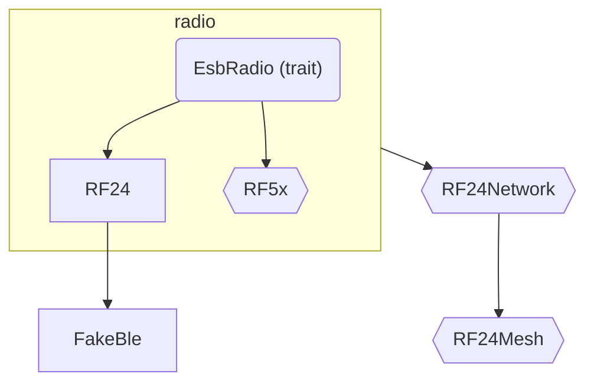

# Differences in RF24 API conventions

This document will highlight the differences between RF24 API implemented in C++ and this rf24-rs package's API.

There are some important design decisions here.

[traits]: https://doc.rust-lang.org/book/ch10-02-traits.html
[result]: https://doc.rust-lang.org/book/ch02-00-guessing-game-tutorial.html#handling-potential-failure-with-result

## `st*Listening()` methods renamed

The C++ library's `startListening()` and `stopListening()` have been renamed to clarify their intended behavior.

### `as_rx()`

`startListening()` from the C++ library is named `as_rx()` in the rf24-rs crate.
This should clearly imply that the function adequately prepares the radio for RX operation.

The `open_rx_pipe()` method (equivalent to the C++ library's `openReadingPipe()`) can be safely used in
either RX or TX mode.

### `as_tx()`

`stopListening()` from the C++ library is named `as_tx()` in the rf24-rs crate.
This should clearly imply that the function adequately prepares the radio for TX operation.

The C++ `openWritingPipe(tx_address)` method has been deprecated in favor of `startListening(tx_address)`.
In the rf24-rs crate, there is no `open_tx_pipe()` method.
Instead, the rf24-rs crate's `as_tx(Option<&[u8]>)` method takes an optional TX address to reflect
the recommended C++ method.

| Language | Set the TX address  | Reuse previous TX address |
|:--------:|:--------------------|:--------------------------|
| C++      | `radio.stopListening(tx_address)` | `radio.stopListening()` |
| Rust     | `radio.as_tx(Some(&tx_address))`  | `radio.as_tx(None)` |
| Python   | `radio.as_tx(tx_address)`         | `radio.as_tx()` |
| Node.js  | `radio.asTx(txAddress)`           | `radio.asTx()` |

### `is_rx()`

The rf24-rs crate offers an `is_rx()` method to programmatically identify when the radio is in RX mode.
There is no equivalent method in the C++ library.

If this method returns `false`, then the radio is in TX mode.
Active TX operations can be determined by the radio's CE pin's state (and the [STATUS byte](#status-byte-exposed));
HIGH for actively transmitting (if TX FIFO is occupied and no transmissions failed),
LOW for TX standby mode (also referred to in the API documentation as "inactive TX mode").

## `read()` length is optional

Since the length of the buffer passed to `RF24::read()` can be determined programmatically,
it is not required to specify how many bytes to read into the buffer.

Better yet, the number of bytes read from the RX FIFO can be determined automatically (in order of precedence):

1. The length of the buffer passed to `buf`  parameter.
2. The length of currently configured static payload size if dynamic payloads are disabled.
3. The length of the next available payload in the RX FIFO if dynamic payloads are enabled.

If any of the above conditions evaluates to `0`, then `RF24::read()` does nothing.

Remember, the dynamic payloads feature is toggled  using `RF24::set_dynamic_payloads()`.
Static payload sizes are set using `RF24::set_payload_length()`.
If dynamic payloads are enabled then setting static payload size has no affect.

## STATUS byte exposed

As with our other implementations, the STATUS byte returned on every SPI transaction is cached to a private member.
Understanding the meaning of the status byte is publicly exposed via

- `update()`: used to get an update about the status flags from the radio.
- `clear_status_flags()`: used to specify which flag(s) should be cleared.
- `get_status_flags()`: similar to `update()` but without any SPI transaction.
   This only returns the internally cached STATUS byte received from the latest SPI transaction.
- `set_status_flags()`: used to configure the radio's CE pin.

    | Language | only trigger IRQ pin on RX_DR (received data ready) events |
    |:--------:|:-----------------------------------------------------------|
    | C++  | `radio.setStatusFlags(RF24_RX_DR)` |
    | Rust | `radio.set_status_flags(StatusFlags::default().with_rx_dr(true))` |
    | Python | `radio.set_status_flags(StatusFlags(rx_dr=True))` |
    | Node.js | `radio.setStatusFlags({ rxDr: true })` |

In this library, setting, getting, and clearing the status flags is done with a `StatusFlags` object.

## No babysitting

To transmit something, RF24 struct offers

- `send()`: blocking wrapper around `write()`
- `write()`: non-blocking uploads to TX FIFO.

    Use `update()` and `get_status_flags()` to determine if transmission was successful or not.
    The IRQ pin can also be used to trigger calls to `update()` + `get_status_flags()`.
    See `set_status_flags()` about configuring the IRQ pin.

There will be no equivalents to C++ `writeBlocking()`, `startFastWrite()`, `writeFast()`, `txStandby()`.
Considering the exposed STATUS byte, these can all be done from the user space (if needed).

Additionally, `send()` does _**not**_ implement a timeout.
Any member function in the `RF24` struct that interacts with hardware will return a [`Result`][result],
so problems with the SPI connections should be detected early in the app lifecycle.
The rustc compiler will warn users about unhandled [`Result`][result]s.
In the Python and Node.js bindings, an exception is thrown when hardware misbehavior is detected.

## API structure

You'll notice that I used an API structure similar to CircuitPython_nRF24L01.
Under the hood is very much like C++ RF24 lib with respect to radio configuration.

Using rust's [trait][traits] feature, I plan to have an API structured like so

<!-- markdownlint-disable MD046 -->
!!! info "Graph Legend"

    In the above graph, nodes in angle brackets are not implemented yet.
    This is just how I envision the final result.

This way users can devise their own implementation of the the `EsbRadio` traits and still pass their derivative to the network/mesh implementations provided.
