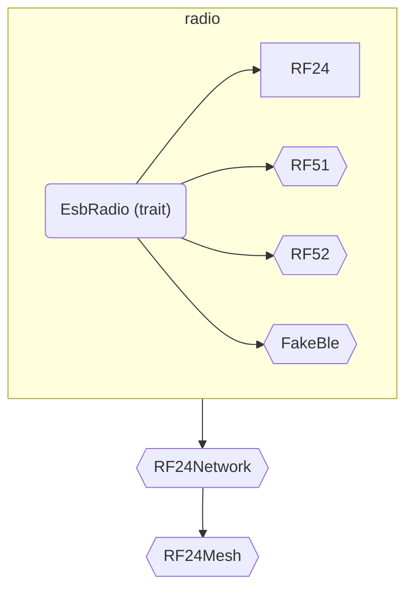

# Differences in RF24 API conventions

This document will highlight the differences between RF24 API implemented in C++ and this rf24-rs package's API.

There are some important design decisions here.

[traits]: https://doc.rust-lang.org/book/ch10-02-traits.html
[result]: https://doc.rust-lang.org/book/ch02-00-guessing-game-tutorial.html#handling-potential-failure-with-result

## `read()` length is optional

Since the length of the buffer passed to `RF24::read()` can be determined programmatically,
it is not required to specify how many bytes to read into the buffer.

Better yet, the number of bytes read from the RX FIFO can be determined automatically (in order of precedence):

1. The length of the buffer passed to `buf`  parameter.
2. The length of currently configured static payload size if dynamic payloads are disabled.
3. The length of the next available payload in the RX FIFO if dynamic payloads are enabled.

If any of the above conditions evaluates to `0`, then `RF24::read()` does nothing.

Remember, the dynamic payloads feature is toggled  using `RF24::set_dynamic_payloads()`.
Static payload sizes are set using `RF24::set_payload_length()`.
If dynamic payloads are enabled then setting static payload size has no affect.

## STATUS byte exposed

As with our other implementations, the STATUS byte returned on every SPI transaction is cached to a private member. Understanding the meaning of the status byte is publicly exposed via

- `update()`: used to get an update about the status flags from the radio.
- `clear_status_flags()`: with parameters to specify which flag(s) should be cleared.
- `get_status_flags()`: has a signature similar to C++ `whatHappened()` but does not update nor clear the flags.
- `set_status_flags()`: similar to C++ `maskIRQ()` except the boolean parameters' meaning is not reversed.

    | lang | only trigger on RX_DR events |
    |:----:|:-----------------------------|
    | C++  | `radio.maskIRQ(false, true, true)` |
    | Rust | `radio.set_status_flags(true, false, false)` |

    In this library, passing `true` to any parameter of `set_stats_flags()` will enable the IRQ for the corresponding event (see function's documentation).

## No babysitting

To transmit something, RF24 struct offers

- `send()`: blocking wrapper around `write()`
- `write()`: non-blocking uploads to TX FIFO.

   Use `update()` and `get_status_flags()` get the updated status flags to determine if transmission was successful or not. The IRQ pin can also be used to trigger calls to `update()` + `get_status_flags()`. See `set_status_flags()` about configuring the IRQ pin.

There will be no equivalents to C++ `writeBlocking()`, `startFastWrite()`, `writeFast()`, `txStandby()`.
Considering the exposed STATUS byte, these can all be done from the user space (if needed).

Additionally, `send()` does _**not**_ implement a timeout.
Every member function in the `RF24` struct (except the `new()`) returns a [`Result`][result],
so problems with the SPI connections should be detected early in the app lifecycle.
The rustc compiler will warn users about unhandled [`Result`][result]s.

As an alternative, I've been considering an optional `irq_pin` parameter to the constructor.
If specified in user code, then `send()` shall wait for the IRQ pin to become active instead of pinging the radio's STATUS byte over SPI.

> [!TIP]
> Rust does offer a way to overload functions using [traits] (feature akin to C++ templates),
> but it isn't traditionally relied upon in a public API.

## API structure

You'll notice that I used an API structure similar to CircuitPython_nRF24L01.
Under the hood is very much like C++ RF24 lib with respect to radio configuration.

Using rust's [trait][traits] feature, I plan to have an API structured like so

<!-- markdownlint-disable MD046 -->
!!! info "Graph Legend"

    In the above graph, nodes in angle brackets are not implemented yet.
    This is just how I envision the final result.

This way users can devise their own implementation of the the `EsbRadio` traits and still pass their derivative to the network/mesh implementations provided.
